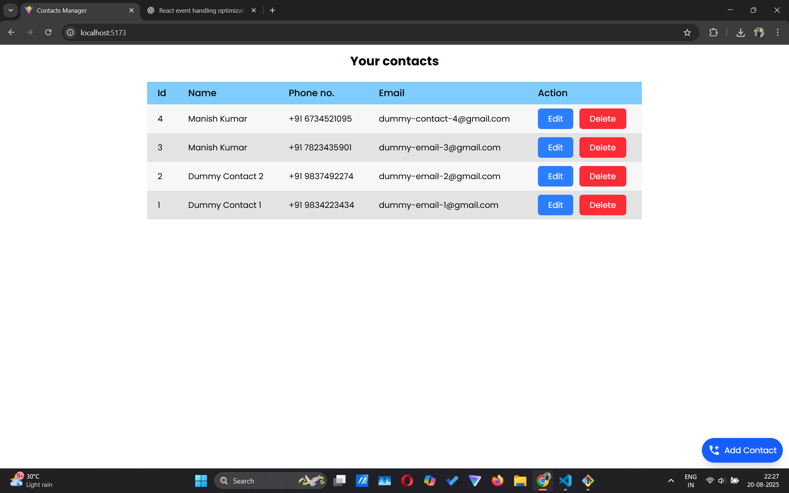
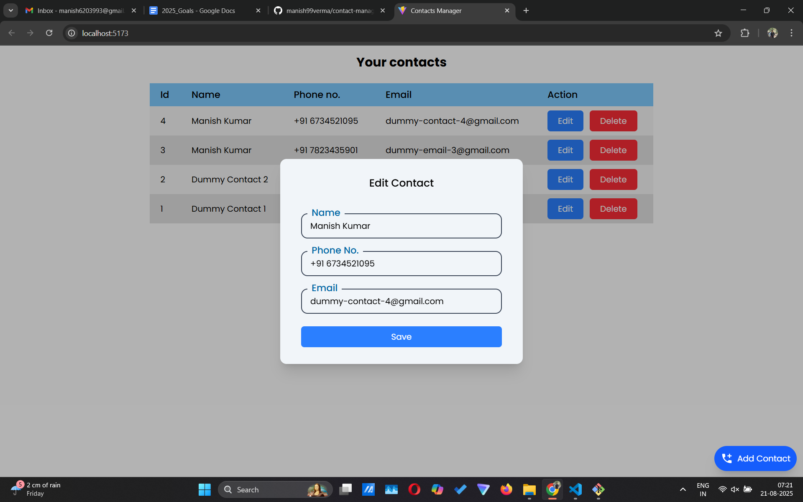
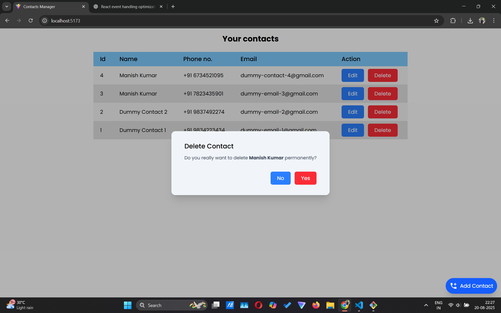
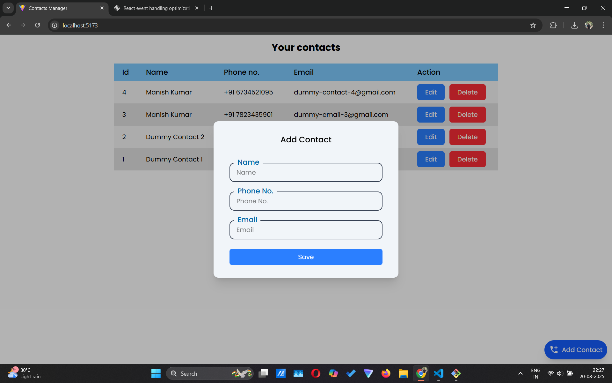

# 📇 React Contact Manager App

A simple yet powerful **Contact Manager** built with **React** and **Redux**.  
It supports adding, editing, deleting, and updating contacts with full form validation and duplicate checks.  
Each contact contains a **Name**, **Email**, and **Phone Number**.

---

## 🚀 Features

- ✅ **Add Contacts** with name, email, and phone number
- ✅ **Input Validation**
  - Email must follow a valid format
  - Phone number can contain digits (and optional `+`, spaces)
  - Required fields cannot be empty
- ✅ **Duplicate Check**
  - Prevents duplicate emails or phone numbers
- ✅ **Edit Contacts** via a form modal
- ✅ **Delete Contacts** with confirmation modal
- ✅ **Update Contacts** with live state management using Redux

---

## 🛠️ Tech Stack

- **React 19**
- **Redux Toolkit**
- **React-Redux**
- **TailwindCSS** (for styling)

---

## 📦 Installation

1. Clone the repository:

```bash
git clone https://github.com/manish99verma/contact-manager.git
cd react-contact-manager
```

2. Install dependencies:

```bash
npm install
```

3. Start development server:

```bash
npm start
```

4. Open in browser:  
   👉 http://localhost:5173

---

## 📸 Screenshots






---

## ⚙️ Usage Guide

1. **Add Contact**

   - Click `+ Add Contact`
   - Fill in name, email, and phone number
   - If validation passes and no duplicates found → contact is saved

2. **Edit Contact**

   - Click `Edit` on a contact
   - Update details in the modal
   - Save → state updates instantly

3. **Delete Contact**
   - Click `Delete` → confirmation modal
   - Confirm → contact removed

---

## 🎯 Future Improvements

- [ ] Authentication (user-specific contact storage)
- [ ] Cloud sync
- [ ] Search and filter contacts
- [ ] Pagination for large contact lists
- [ ] Import / Export contacts (CSV, JSON)

---

## 🤝 Contributing

Pull requests are welcome! Please open an issue first for feature discussions.

---

## 📄 License

This project is licensed under the **MIT License**.  
Feel free to use and modify for personal or commercial projects.
